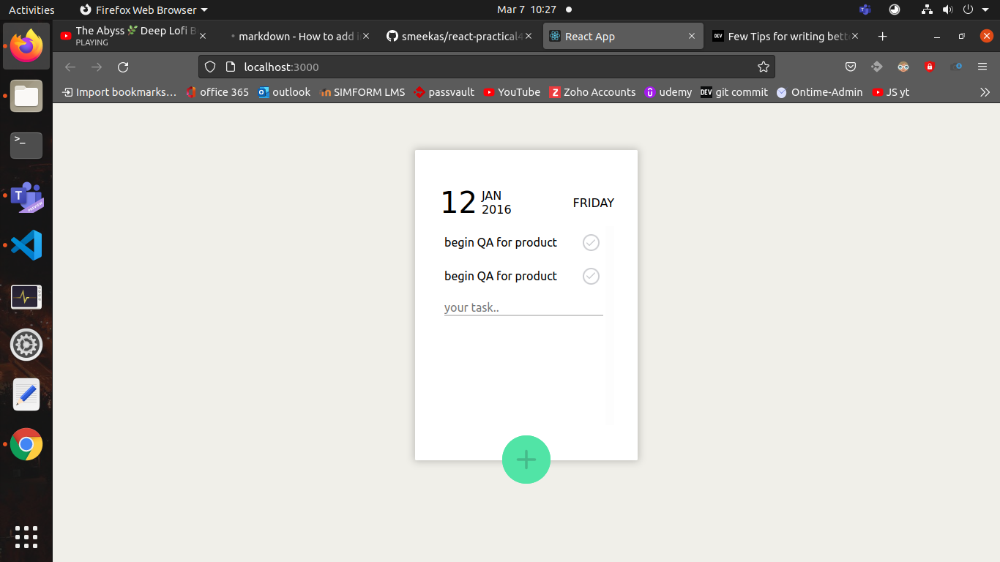

# react-practical-4

## UI part of todo app using styled components




# react-practical-4

## UI part of todo app using styled components

## Getting Started

1. Setup React

2. Clone the repo</br>

```sh
  git clone https://github.com/smeekas/react-practical4/
```

3. change directory</br>

```sh
  cd ./react-practical4
```

4. Install dependency</br>

```sh
  npm install
```

5. Run the app</br>

```sh
  npm start
```

6. Production build</br>

```sh
  npm run build
```

## App preview